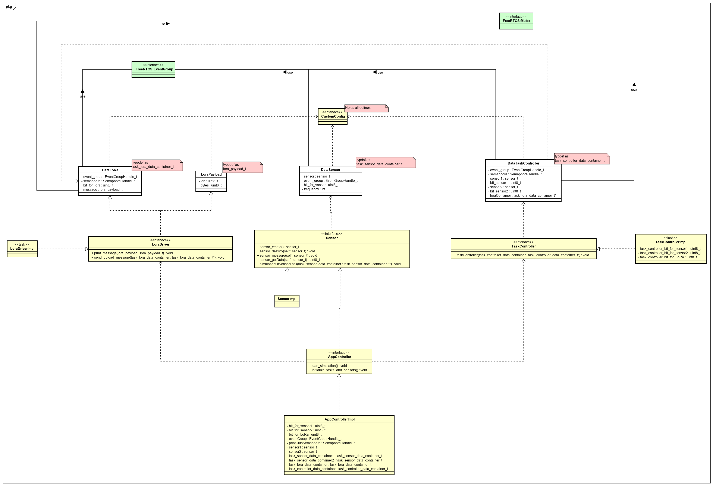

# Multi threaded solution for the sensor simulator

Written in C with use of the FreeRTOSv10.3.1, this software simulate multiple sensors being run at the same time.
Software works as presented on the diagram below:

